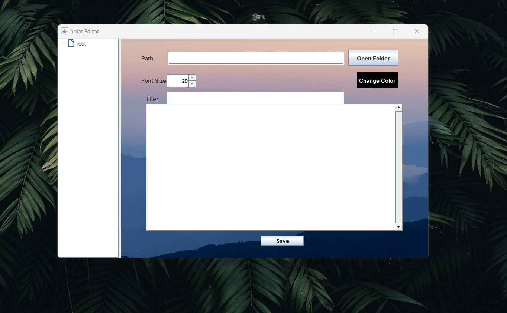
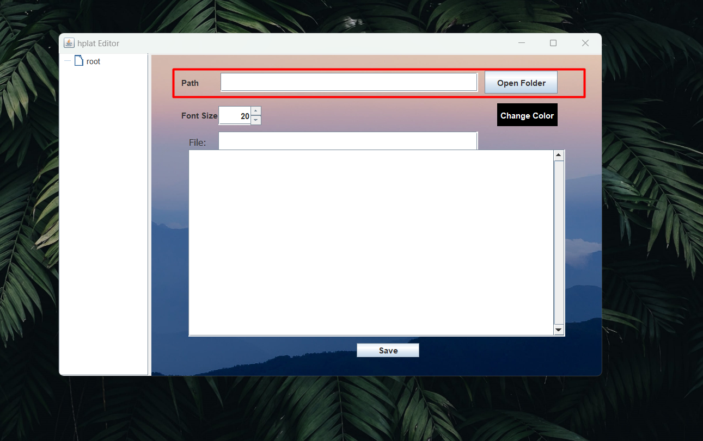
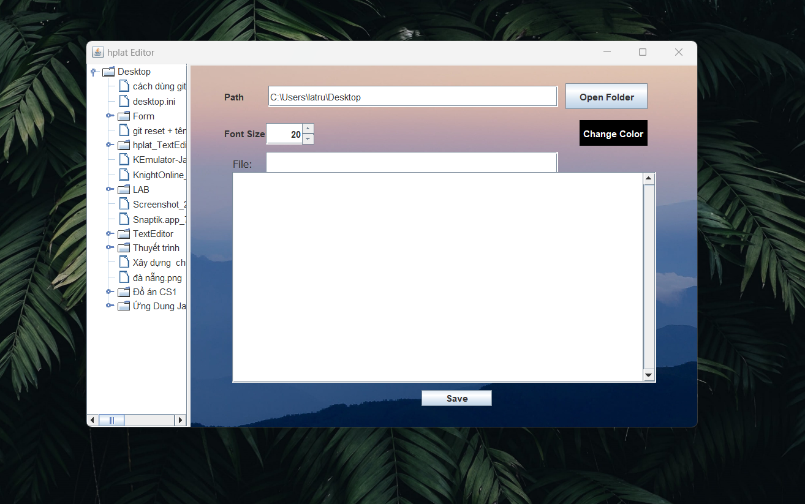
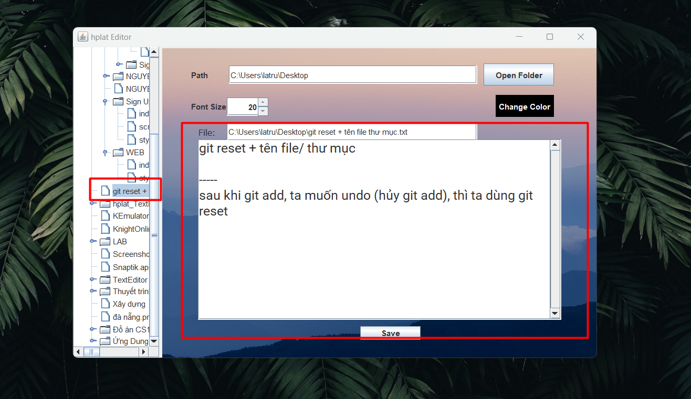
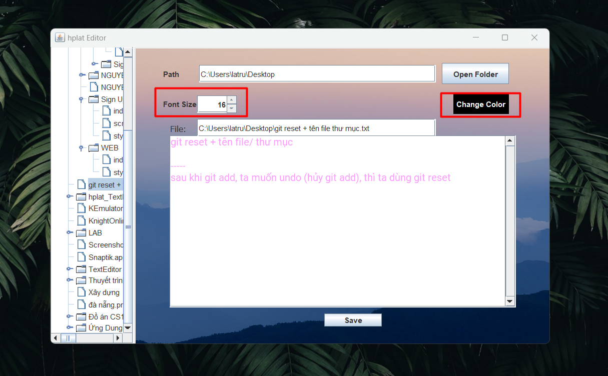

# Text Editor Using Java Swing

First, You need select folder via the 'open folder' button

The folder tree will appear in the left side

Select file to edit

Besides, you can modify font size and font color

